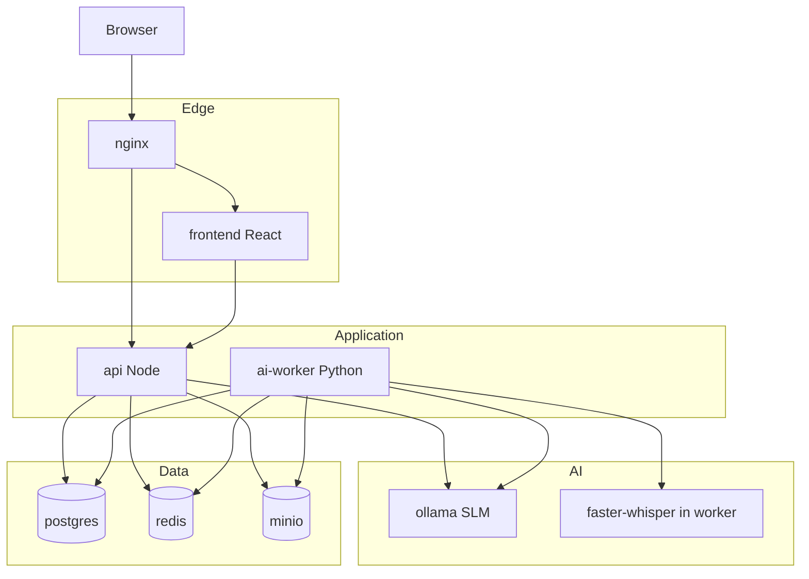
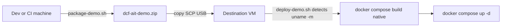
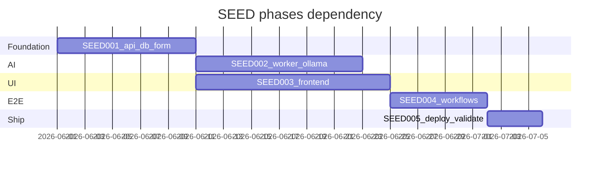

# DCF AIT Demo — Implementation Plan

## Current state

| Area | Status |
|------|--------|
| Architecture, 8 OpenSpec domains, ADRs D1–D8 | Done ([`Docs/DCF-AIT-PLATFORM-ARCHITECTURE.md`](Docs/DCF-AIT-PLATFORM-ARCHITECTURE.md), [`Docs/adr/`](Docs/adr/README.md)) |
| OpenAPI v1 (~30 routes) | Done ([`openapi.yaml`](openapi.yaml)) |
| Schemas, official 51A template | Done ([`codebase/api/schemas/`](codebase/api/schemas/), [`codebase/api/templates/51A-Report-Form.html`](codebase/api/templates/51A-Report-Form.html)) |
| Docker Compose (incl. `ollama`, `ollama-init`) | Skeleton only ([`codebase/deploy/docker-compose.yml`](codebase/deploy/docker-compose.yml)) |
| `api`, `worker`, `frontend` application code | **Not started** (Dockerfiles are placeholders) |
| UI reference | [`mockup/DCF_AIT_UI.jsx`](mockup/DCF_AIT_UI.jsx) (~1.1k lines, single-file prototype) |

**Gate before coding:** Stakeholder sign-off on architecture §22.3 (or explicit “proceed” for demo build).

**VM prerequisites:** ~16 GB RAM recommended for `llama3.2:3b` + faster-whisper on CPU; first `docker compose up` needs network for `ollama-init` pull.

---

## Target runtime architecture

**Pipeline flow (happy path):** audio upload → MinIO `audio/input/` → worker transcribe → clean → Ollama NLP → merge via API/use case → screener checkpoint → background mocks + risk/docs → submit.

---

## Implementation principles

1. **Contract-first:** Implement REST from [`openapi.yaml`](openapi.yaml); update spec before API shape changes ([ADR-DCF-0004](Docs/adr/ADR-DCF-0004-openapi-and-websocket.md)).
2. **No AI stubs:** Real Whisper + Ollama only ([ADR-DCF-0001](Docs/adr/ADR-DCF-0001-demo-inference-ollama.md)).
3. **51A gates in API:** `409 FORM_51A_INCOMPLETE` enforced server-side ([ADR-DCF-0008](Docs/adr/ADR-DCF-0008-51a-checkpoint-gate.md)).
4. **Hexagonal adapters:** `Whisper*`, `Ollama*`, mock `Ccwis*`, `Background*` ([ADR-DCF-0006](Docs/adr/ADR-DCF-0006-mock-integration-adapters.md)).
5. **Validate against OpenSpec** per domain after each phase ([`openspec/specs/*/spec.md`](openspec/specs/)).
6. **Demo packaging:** Ship source + deploy assets via zip; **build images on the destination host** (native arch). Update packaging/deploy scripts **after every feature build** (see [Demo deployment scripts](#demo-deployment-scripts-pack-and-install)).

---

## Demo deployment scripts (pack and install)

Two bash scripts support air-gapped or SSH-based demo installs. They live under [`codebase/deploy/scripts/`](codebase/deploy/scripts/).

### Script 1 — `package-demo.sh` (run on build machine)

**Purpose:** Produce a portable zip for copying to the deployment VM (USB, SCP, artifact share).

**Behavior:**

- Resolve repo root; write `dist/dcf-ait-demo-<version>-<git-sha-short>.zip` (version from `package.json` or `VERSION` file when present, else date stamp).
- Include only deployable artifacts (no `node_modules`, `.git`, Docker volumes, or local `.env` secrets).
- Emit `PACKAGE_MANIFEST.txt` inside the zip (file list + sha256 per file) for integrity checks on the target.
- **Initial manifest (SEED-001 bootstrap):** `codebase/api/`, `codebase/worker/`, `codebase/frontend/`, `codebase/deploy/` (compose, nginx, `.env.example`, scripts), root `openapi.yaml` (contract reference).
- **Exclude:** `pgdata`, `miniodata`, `ollamadata`, `redisdata`, `dist/`, `coverage/`, `*.log`, committed `.env`.

**Flags (planned):**

- `--output-dir` — where to write the zip (default `dist/` at repo root).
- `--dry-run` — print would-be contents without zipping.

### Script 2 — `deploy-demo.sh` (run on destination VM)

**Purpose:** Unpack the zip and start the stack using **the destination machine’s CPU architecture** (no cross-arch images built on a dev laptop).

**Behavior:**

1. **Preflight:** `docker` and `docker compose` available; disk/RAM checks documented in README.
2. **Detect target arch** from destination infra (not from the packager’s machine):
   - `uname -m` → map to Docker platform (`x86_64` → `linux/amd64`, `aarch64`/`arm64` → `linux/arm64`).
   - Optional: `docker info --format '{{.Architecture}}'` as secondary confirmation.
   - Export `DOCKER_DEFAULT_PLATFORM` or pass `docker compose build --build-arg` only when needed; **default path is native `docker compose build`** so BuildKit compiles for the host arch.
3. Unzip to install root (default `/opt/dcf-ait` or `./dcf-ait`, overridable via `--install-dir`).
4. `cp deploy/.env.example deploy/.env` if `.env` missing; print reminder to set `POSTGRES_PASSWORD`, `MINIO_ROOT_PASSWORD`, `JWT_SECRET`.
5. `cd deploy && docker compose build && docker compose up -d` (runs `ollama-init` on first boot).
6. Print URLs (HTTP/HTTPS ports from `.env`) and point to `smoke.sh`.

**Flags (planned):**

- `--zip-path` — path to artifact zip (required).
- `--install-dir` — extraction target.
- `--skip-build` — reuse existing images (upgrade path).
- `--pull-only` — for pre-published images only if introduced later; **not default** for demo.

### Maintenance rule — update after every feature build

Packaging and deploy paths **must stay in sync** with the codebase as features land. Treat this as part of “done” for each SEED task or PR slice:

| When you add… | Update |
|---------------|--------|
| New service directory, Dockerfile, or compose service | `package-demo.sh` include paths + `PACKAGE_MANIFEST` generation |
| New env var required at runtime | `.env.example` + `deploy-demo.sh` preflight hints |
| New volume, init container, or deploy-only file | Include in zip; document in [`codebase/deploy/README.md`](codebase/deploy/README.md) |
| New smoke/health check | Wire `deploy-demo.sh` optional `--smoke` to call `smoke.sh` |

**Checklist (copy into PR / task closeout):**

- [ ] Ran `package-demo.sh` locally; zip extracts cleanly in a temp dir.
- [ ] Ran `deploy-demo.sh` (or dry-run) against that zip; native `docker compose build` succeeds.
- [ ] `PACKAGE_MANIFEST.txt` matches actual zip contents.

**Schedule:**

- **SEED-001:** Introduce script skeletons + minimal manifest (api/deploy only if worker/frontend not ready).
- **After each SEED-002/003/004 feature slice:** Extend manifest and re-verify both scripts before marking the slice complete.
- **SEED-005:** Harden scripts (TLS prod compose overlay, `--smoke`, exit codes, HANDOVER install section).

---

## Phase 1 — SEED-001: Platform foundation

**Goal:** Runnable `api` + data layer; 51A domain and auth enforceable without full AI.

### 1.1 API scaffold (Node)

Create under [`codebase/api/`](codebase/api/):

- `package.json`, TypeScript (matches Dockerfile `dist/index.js`), Express, `pg`, Redis client, MinIO SDK, JWT, zod/AJV for schema validation.
- Layered layout: `src/routes/`, `src/usecases/`, `src/domain/`, `src/adapters/`, `src/middleware/` (auth, RBAC, audit, error handler).
- `GET /api/v1/health` (DB + Redis + MinIO ping).
- Wire [`codebase/deploy/docker-compose.yml`](codebase/deploy/docker-compose.yml) build context; fix placeholder `npm ci` until `package-lock.json` exists.

### 1.2 Database

- Migration tool (recommend **node-pg-migrate** or **Knex**—pick one, stay consistent).
- Tables per architecture §17: `cases` (incl. `form51a_checkpoint_status`), `form_51a_fields`, `transcript_segments`, `triage_flags`, `risk_assessments`, `background_check_runs`, `screening_decisions`, `briefings`, `report_51b_versions`, `audit_events`, `pipeline_state`.
- Seed script optional: one demo case per role testing.

### 1.3 Auth & RBAC ([ADR-DCF-0005](Docs/adr/ADR-DCF-0005-security-jwt-rbac-policy.md))

- `POST /auth/demo-login`, `GET /auth/me`.
- JWT middleware; role matrix for case routes.
- `PolicyEngine`: block automated screen-in/removal/determination.

### 1.4 Form 51A core ([ADR-DCF-0007](Docs/adr/ADR-DCF-0007-dual-51a-representation.md), [ADR-DCF-0008](Docs/adr/ADR-DCF-0008-51a-checkpoint-gate.md))

- `GET/PATCH /cases/{caseId}/form51a` — validate against [`51a-form.schema.json`](codebase/api/schemas/51a-form.schema.json).
- Use cases: `MergeNlpIntoForm51a`, `UpdateForm51aField`, `ConfirmForm51aSection`, `CompleteForm51aCheckpoint`.
- `MapReport51aToOfficialFields` + `RenderOfficial51AHtml` using [`51a-official-field-map.json`](codebase/api/schemas/51a-official-field-map.json) + template.
- Routes: `confirm-section`, `complete-checkpoint`, `official`, `official/field-map`.
- `POST /cases/{caseId}/submit` → **409** if checkpoint ≠ `complete`.

### 1.5 Infrastructure helpers

- MinIO bootstrap: bucket `ait-artifacts`, folder prefixes (§17.2).
- Redis: enqueue helper + pub/sub channel `case:{id}:events`.
- Audit module: append `audit_events` on mutations and checkpoint transitions.

### 1.6 Case & intake stubs (minimal)

- `POST/GET /cases`, `GET/PATCH /cases/{caseId}`.
- `POST /cases/{caseId}/audio` → stream to MinIO `audio/input/` + enqueue pipeline job (handler can no-op until SEED-002).

### 1.7 Demo pack/deploy scripts (bootstrap)

- Add [`codebase/deploy/scripts/package-demo.sh`](codebase/deploy/scripts/package-demo.sh) and [`deploy-demo.sh`](codebase/deploy/scripts/deploy-demo.sh) (executable, `set -euo pipefail`).
- Add [`codebase/deploy/README.md`](codebase/deploy/README.md) — install steps, arch detection, secrets, first Ollama pull.
- Manifest includes at minimum: `codebase/api/`, `codebase/deploy/`; extend in later SEEDs as worker/frontend land.

**Phase 1 exit criteria**

- `docker compose up` builds `api`; health OK; demo-login works for four roles.
- `package-demo.sh` produces a zip; `deploy-demo.sh` on a clean Linux host (amd64 or arm64) builds and starts stack.
- PATCH form + complete checkpoint + submit gate returns 409 then 200.
- Official HTML opens with mapped fields from test JSON.

---

## Phase 2 — SEED-002: AI pipeline

**Goal:** Real pipeline in [`codebase/worker/`](codebase/worker/) (Python); Ollama + Whisper; events to UI via Redis.

### 2.1 Worker scaffold

- Python 3.11+, asyncio or threaded workers, `redis`, `boto3`/minio, `httpx` for Ollama, `faster-whisper`.
- Consume jobs from Redis (or poll MinIO notifications simplified for demo).
- **Anti-recursion:** ignore writes under own output prefixes ([`ai-pipeline` spec](openspec/specs/ai-pipeline/spec.md)).

### 2.2 Ports & adapters

| Port | Demo adapter |
|------|----------------|
| `ITranscriptionService` | `WhisperTranscriptionService` |
| `INlpExtractor` | `OllamaNlpExtractor` (JSON schema prompts) |
| `IRiskScorer` | `OllamaRiskScorer` |
| `ITriageEngine` | Keyword rules + `OllamaTriageEngine` |
| `IDocumentGenerator` | `OllamaDocumentGenerator` (parallel sections) |
| `IAssistantResponder` | Used from **api** sync path (`OllamaAssistant`) |

Shared: `OllamaClient` (retry, timeout, health); record `ollama_model` in audit payloads.

### 2.3 Stages (order)

1. **Transcribe** — faster-whisper → `transcribe/output/`; publish partials → Redis `transcript.line`.
2. **Clean** — normalize text; optional Ollama S/C speaker labels.
3. **NLP** — Ollama → `nlp/output/`; call API internal hook or write DB + trigger `MergeNlpIntoForm51a` (prefer HTTP callback to api or shared DB write in worker with domain rules duplicated minimally—**prefer api endpoint** `POST /internal/...` or reuse merge use case via repository in worker).
4. **Keywords** — taxonomy on partial transcript; `triage.alert` events.
5. **Risk/triage** — after NLP; `risk/output/`.
6. **Background** — only if checkpoint `complete` (listen domain event or poll case status); mock 5 sources ([ADR-DCF-0006](Docs/adr/ADR-DCF-0006-mock-integration-adapters.md)).
7. **Documents** — Ollama sections + JSON repair (max 3) + schema validator.

### 2.4 API integration

- Wire remaining OpenAPI routes: `transcript`, `risk`, `risk/override`, `triage-flags`, `triage-decisions`, `background-checks`, `assistant-messages`.
- WebSocket server on `api` (adjunct to OpenAPI): `transcript.line`, `form.field.updated`, `form.checkpoint.changed`, `pipeline.stage`.

**Phase 2 exit criteria**

- Upload audio on a case → transcript appears (≤~10s demo target on modest CPU).
- NLP populates form with `source=ai`; checkpoint moves to `ready_for_review`.
- Ollama down → graceful degradation + `model.unavailable` audit (no crash loop).
- **Pack/deploy:** manifest includes `codebase/worker/`; scripts re-verified on this slice.

---

## Phase 3 — SEED-003: Frontend

**Goal:** Production React app replacing mockup interactivity; API-driven.

### 3.1 Scaffold

- Vite + React + TypeScript under [`codebase/frontend/`](codebase/frontend/).
- Extract design tokens and shared components from [`mockup/DCF_AIT_UI.jsx`](mockup/DCF_AIT_UI.jsx) into `src/theme/`, `src/components/`.
- React Router: role-based layouts (Screener, Supervisor, Worker, Admin).

### 3.2 API client

- Generate types from OpenAPI (`openapi-typescript` or similar).
- Auth: store JWT; attach to requests.
- `VITE_API_BASE_URL` per [ADR-0018](system-prompts-skills/architecture-adr/ADR-0018-dynamic-demo-urls.md) / compose env.

### 3.3 Critical screens (priority order)

1. **Login** → `POST /auth/demo-login`
2. **Screener dashboard** → `GET /cases`
3. **Intake** — `AudioUpload`, `TranscriptPanel`, dynamic `FormSection` from `GET /form51a`, `TriageSection`, `RiskScoreCard`, `AIAssistant`, `BgChecks` (disabled until checkpoint)
4. **Checkpoint UX** — confirm-section API; disable Submit until `checkpointStatus=complete`; **Print 51A** → `window.open(.../form51a/official)`
5. **Supervisor** — pending queue, expand rows, screening decision
6. **Worker** — briefing, 51B draft/approve/compliance
7. **Admin** — health, models (read-only)

### 3.4 WebSocket client

- Subscribe on intake page; update transcript, form chips, pipeline status.

**Phase 3 exit criteria**

- UI matches mockup tokens (navy/teal/coral); AI fields visually distinct (`dcf-input.ai`).
- Submit bar disabled until checkpoint complete.
- **Pack/deploy:** manifest includes `codebase/frontend/`; scripts re-verified on this slice.

---

## Phase 4 — SEED-004: End-to-end workflows

**Goal:** Demo-ready paths per [`Docs/FSD-DEMO.md`](Docs/FSD-DEMO.md) acceptance.

| Workflow | Validates |
|----------|-----------|
| Screener E2E | Audio → transcript → form → review → checkpoint → print → background → risk/triage → submit |
| Supervisor | Pending list, summary, screen-in/out/clarify + audit |
| Worker | Briefing, field notes/memo → 51B draft → compliance → approve |
| Admin | Health/models; no case narrative for IT admin |

- Clinical review flag (mock CCWIS 3+ incidents / 12 mo).
- Emergency routing when ≥2 triage indicators confirmed.
- Cross-check [`Docs/TRACEABILITY.md`](Docs/TRACEABILITY.md) rows S1–S11.

**Phase 4 exit criteria**

- All four roles complete primary flows on Docker without manual DB edits.
- Release gates in FSD §6 satisfied.
- **Pack/deploy:** full manifest; install tested end-to-end from zip only (no git on VM).

---

## Phase 5 — SEED-005: Deploy and validate

- [`docker-compose.prod.yml`](codebase/deploy/) — TLS volume, stricter defaults.
- Document secrets and first-boot Ollama pull in [`codebase/deploy/README.md`](codebase/deploy/README.md).
- **Smoke script:** [`codebase/deploy/scripts/smoke.sh`](codebase/deploy/scripts/smoke.sh) — health, login, create case, upload sample audio, assert checkpoint gate; callable from `deploy-demo.sh --smoke`.
- **Finalize pack/deploy:** version stamping in zip name, manifest checksum validation, clear exit codes, install section in `Docs/HANDOVER.md`.
- OWASP demo checklist (TLS, secrets, RBAC spot checks, no PII in logs).

**Phase 5 exit criteria**

- Fresh VM: copy zip only → `deploy-demo.sh` → stack healthy (native arch build).
- Optional: `docker compose -f docker-compose.yml -f docker-compose.prod.yml up` for TLS profile.
- Smoke script passes after deploy.

---

## Suggested execution order and parallelism

- **Parallel after Phase 1 week 1:** Frontend shell (login, layout) can start while 51A use cases finish.
- **Do not** start full intake WebSocket UX until Phase 2 publishes events.

---

## Key files to create (greenfield)

| Path | Purpose |
|------|---------|
| `codebase/api/src/index.ts` | Express entry |
| `codebase/api/migrations/*` | Postgres schema |
| `codebase/api/src/usecases/form51a/*` | Checkpoint + official render |
| `codebase/api/src/policy/PolicyEngine.ts` | Human-in-the-loop |
| `codebase/worker/main.py` | Pipeline consumer |
| `codebase/worker/adapters/ollama_client.py` | Shared SLM client |
| `codebase/worker/adapters/whisper_transcription.py` | ASR |
| `codebase/frontend/src/pages/*` | Role screens |
| `codebase/deploy/scripts/package-demo.sh` | Zip artifact for offline/SSH deploy |
| `codebase/deploy/scripts/deploy-demo.sh` | Unzip + native-arch `docker compose` on destination |
| `codebase/deploy/scripts/smoke.sh` | Post-deploy E2E smoke |
| `codebase/deploy/README.md` | Install, arch, secrets, pack/deploy usage |
| `codebase/deploy/PACKAGE_MANIFEST.txt` | Generated inside zip (not committed) |

---

## Risks and mitigations

| Risk | Mitigation |
|------|------------|
| Ollama OOM on small VM | Document minimum RAM; allow `OLLAMA_MODEL=phi3:mini` in `.env` |
| Slow CPU inference | Set demo expectations; optional shorter audio samples in smoke test |
| Worker/API duplicate form logic | Single merge path: worker writes `nlp/output/`, api owns `MergeNlpIntoForm51a` via DB transaction |
| Mockup port drift | Component checklist against mockup sections |
| Architecture §19 still mentions “mock transcription” | Update doc when starting SEED-002 (one-line fix) |
| Stale zip missing new services/files | Per-feature manifest update + PR checklist |
| Wrong-arch images from dev laptop | Never ship pre-built app images in zip; build on destination via `deploy-demo.sh` |

---

## Out of scope (this implementation)

- Production GovCloud IaC, live CCWIS/CJIS, enterprise IdP.
- GPU inference profile (future ADR if needed).
- Automated test suite beyond smoke + manual OpenSpec walkthrough (add if requested later).
