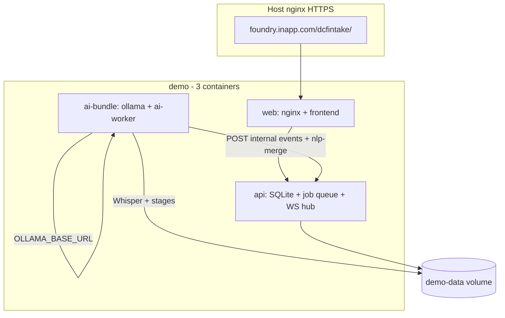

# Demo folder — scaled-down deployment plan (rev 2)

## Goals (updated)

| Goal | Approach |
|------|----------|
| Real AI (Ollama + ai-worker, Whisper) | Deploy [codebase/worker](codebase/worker) + Ollama; **no pipeline stub / no canned mocks** |
| No Postgres | **SQLite** single file on a shared Docker volume |
| No Redis | **SQLite job queue** + **HTTP event publish** to API for WebSocket clients |
| Fewer containers | Collate to **3 services** (see below) |
| Frontend unchanged | Same [codebase/frontend](codebase/frontend) build and `/dcfintake/` paths |
| Simplified, not mocked | Real inference and DB writes; thinner storage/queue layers, not fake responses |
| Production path preserved | Full stack in [codebase/deploy](codebase/deploy) when `AIT_STACK` unset or `production` |

**Plan change vs rev 1:** Removes `demo/infra` (Postgres+Redis+MinIO bundle) and `demo/pipeline-stub`. Requires **scoped backend changes** gated by `AIT_STACK=demo` (production code paths stay on Postgres+Redis+MinIO).



## Target topology — 3 containers

| Service | Contents | Host port |
|---------|----------|-----------|
| **web** | nginx + frontend static (one image, same pattern as today) | `4010` → :80 (for host HTTPS proxy) |
| **api** | Node API, SQLite migrate on start, in-memory WS subscribers | internal |
| **ai-bundle** | supervisord: `ollama` + `ai-worker` (pull model on first start) | none published |

**Removed vs [codebase/deploy/docker-compose.yml](codebase/deploy/docker-compose.yml):** `postgres`, `redis`, `minio`, separate `ollama-init`, separate `nginx`/`frontend`/`ai-worker`/`ollama` as 4+ infra services.

**Shared volume** `demo-data`:

- `/data/ait.db` — SQLite (api + worker)
- `/data/artifacts/` — audio/object storage (replaces MinIO)

## Backend changes (`AIT_STACK=demo`)

Toggle via env on api and ai-worker: `AIT_STACK=demo` (default `production` for existing deploy).

### 1. Database — SQLite

- New migrations: [codebase/api/migrations-sqlite/](codebase/api/migrations-sqlite/) — port of [001–003](codebase/api/migrations/) without `pgcrypto`/UUID extensions; use `TEXT` ids (`crypto.randomUUID()` in app or sqlite-friendly ids).
- [codebase/api/src/db/pool.ts](codebase/api/src/db/pool.ts) — factory: `better-sqlite3` (or `sql.js` + async wrapper) when `AIT_STACK=demo`; existing `pg.Pool` when production.
- [codebase/worker/worker/db.py](codebase/worker/worker/db.py) — branch: `sqlite3` + same SQL shape (parameter style `?`) when `AIT_STACK=demo`.
- [validateConfig.ts](codebase/api/src/middleware/validateConfig.ts) — allow `sqlite:////data/ait.db` when demo; keep PostgreSQL requirement for production.
- **Single writer discipline:** WAL mode; worker + api both open same file on shared volume (acceptable for demo).

### 2. Queue — no Redis

Replace [redisClient.ts](codebase/api/src/services/redisClient.ts) `enqueuePipelineJob` with demo implementation:

```sql
-- pipeline_jobs(id, payload JSON, status, created_at)
```

- API: `INSERT` on audio upload / checkpoint (same call sites as today).
- Worker: poll loop with `SELECT ... WHERE status='pending' LIMIT 1` + mark `processing` (replaces [redis_bus.py](codebase/worker/worker/redis_bus.py) `BRPOP`).
- Keep queue name constant `ait:pipeline:jobs` as table name or logical key for parity.

### 3. Real-time events — no Redis pub/sub

Replace `publishCaseEvent` Redis publish with:

- **New internal route** (demo + production-safe): `POST /api/v1/internal/cases/:caseId/events` + `X-Internal-Key` — body `{ type, ... }` fans out to WebSocket clients via existing [caseEvents.ts](codebase/api/src/ws/caseEvents.ts) in-process registry.
- Worker: [redis_bus.py](codebase/worker/worker/redis_bus.py) `publish_case_event` → HTTP to API when `AIT_STACK=demo` (real events from Whisper/Ollama pipeline, not canned).
- API `attachCaseWebSocket` unchanged; frontend unchanged.

### 4. Artifacts — no MinIO

- New [codebase/api/src/services/artifactStore.ts](codebase/api/src/services/artifactStore.ts): interface `put/get/list` — production → MinIO; demo → filesystem under `ARTIFACT_DIR=/data/artifacts`.
- Worker [minio_store.py](codebase/worker/worker/minio_store.py) — demo branch reads/writes same paths.
- [health.ts](codebase/api/src/routes/health.ts) — demo checks `artifact dir writable` instead of MinIO.

### 5. Worker + Ollama (unchanged logic)

- Keep [stages.py](codebase/worker/worker/pipeline/stages.py): Whisper ASR, Ollama NLP/risk/docs — **real** calls.
- [ollama_client.py](codebase/worker/worker/ollama_client.py) unchanged; `OLLAMA_BASE_URL=http://127.0.0.1:11434` inside **ai-bundle** container.
- Merge **ollama-init** into `demo/ai-bundle/entrypoint.sh` (`ollama pull` once) — no separate init container.

### 6. Production deploy isolation

- [codebase/deploy/docker-compose.yml](codebase/deploy/docker-compose.yml): do **not** set `AIT_STACK=demo`.
- Demo compose only in `demo/docker-compose.yml`.
- Dockerfiles: same [codebase/api/Dockerfile](codebase/api/Dockerfile) and [codebase/worker/Dockerfile](codebase/worker/Dockerfile); demo compose passes `AIT_STACK=demo` + volume mounts.

## `demo/` layout

```
demo/
  README.md
  docker-compose.yml
  .env.example
  ai-bundle/
    Dockerfile          # supervisord: ollama + worker
    supervisord.conf
    entrypoint.sh       # ollama pull then supervisord
  web/
    Dockerfile          # optional: FROM frontend + edge nginx, or compose two services in one
  nginx/                # http-only /dcfintake templates (copy from deploy)
  scripts/
    up.sh
    smoke.sh
    package-demo.sh
```

**web service options (pick one in implementation):**

- **A (simpler):** Keep separate `nginx` + `frontend` services in compose (4 containers) — still fewer than full deploy.
- **B (target 3):** Single `web` Dockerfile: multi-stage frontend build + nginx with `/dcfintake/` (recommended in implementation).

## Environment (demo `.env.example`)

```bash
AIT_STACK=demo
DATABASE_URL=sqlite:////data/ait.db
ARTIFACT_DIR=/data/artifacts
AIT_HTTP_PORT=4010
APP_BASE_PATH=/dcfintake
BEHIND_REVERSE_PROXY=1
CORS_ORIGIN=https://foundry.inapp.com
OLLAMA_MODEL=llama3.2:3b
# No REDIS_URL, no MINIO_*, no POSTGRES_*
```

Host nginx (unchanged): `proxy_pass http://127.0.0.1:4010/dcfintake/;`

## Packaging scripts

| Script | Contents |
|--------|----------|
| [demo/scripts/package-demo.sh](demo/scripts/package-demo.sh) | Zip `demo/`, `codebase/api`, `codebase/worker`, `codebase/frontend` |
| [demo/scripts/up.sh](demo/scripts/up.sh) | `docker compose up -d --build` |
| Root wrapper optional | `scripts/package-docker-demo.sh` → demo packager |

Existing [scripts/package-docker.sh](scripts/package-docker.sh) / [scripts/deploy-docker.sh](scripts/deploy-docker.sh) remain the **full** Postgres/Redis/MinIO/Foundry VM path.

## Implementation order

1. **Adapter interfaces** in api (`db`, `queue`, `artifacts`, `events`) + `AIT_STACK` switch in [config.ts](codebase/api/src/config.ts)
2. **SQLite migrations** + migrate runner branch in [migrate.ts](codebase/api/src/db/migrate.ts)
3. **Internal events route** + wire worker publish path
4. **Worker demo branches** (db, queue poll, fs store, event HTTP)
5. **demo/ai-bundle** image + **demo/web** image
6. **demo/docker-compose.yml** + volume + healthchecks
7. **demo/scripts** + README; HANDOVER “Demo vs full” table
8. **E2E test:** upload audio → live transcript (Whisper) → Ollama NLP merge → 51A form → supervisor queue

## Demo limitations (explicit)

- SQLite + single-node volume: not HA, not concurrent-write safe for production scale
- No Redis: no cross-host fan-out (fine for single VM demo)
- Ollama model still requires RAM/disk and first-pull time on ai-bundle
- SQL dialect differences: demo migrations maintained separately from Postgres migrations
- Full GovCloud/production path remains Postgres + Redis + MinIO in `codebase/deploy`

## Out of scope

- Canned / stub pipeline (rev 1 `pipeline-stub`)
- Bundled Postgres+Redis+MinIO `demo/infra` container
- Changing [codebase/frontend](codebase/frontend) source
- Removing Ollama or Whisper from demo
