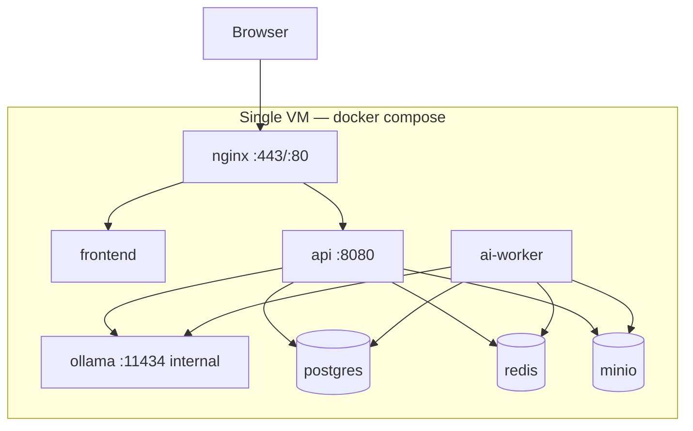
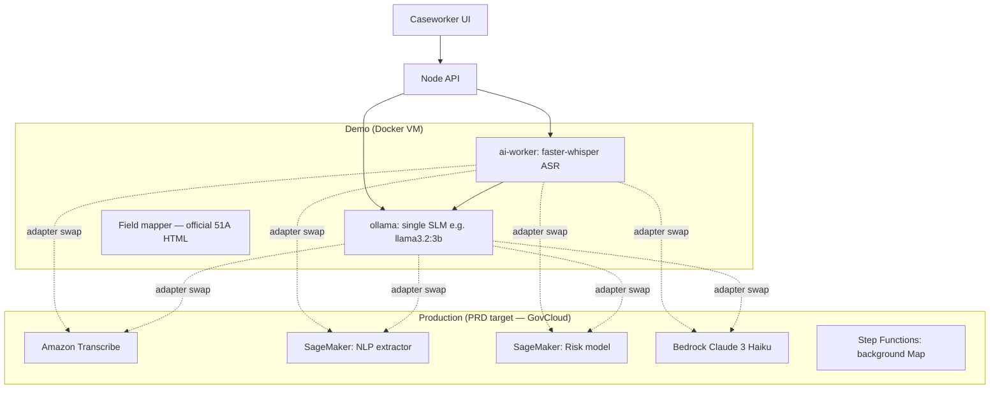
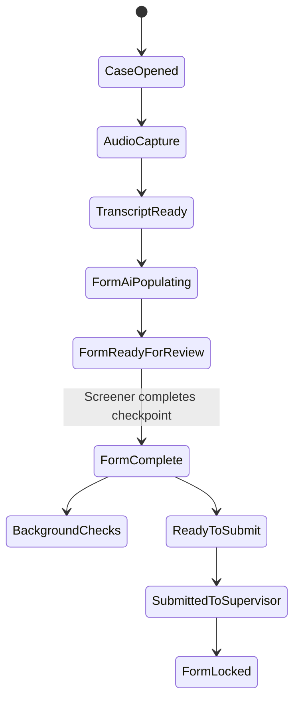

# DCF Automated Intake Tool (AIT) — Platform Architecture

**Document ID:** DCF-AIT-ARCH-001  
**Version:** 1.2  
**Date:** 2026-05-28  
**Status:** Consolidated design — pending stakeholder approval  
**Classification:** CONFIDENTIAL (child welfare system design)

---

## Table of contents

1. [Executive summary](#1-executive-summary)  
2. [Document map & artifact index](#2-document-map--artifact-index)  
3. [Business context & scope](#3-business-context--scope)  
4. [Demo assumptions](#4-demo-assumptions)  
5. [Functional scope (demo FSD)](#5-functional-scope-demo-fsd)  
6. [Platform ADR alignment](#6-platform-adr-alignment)  
7. [Project architecture decisions](#7-project-architecture-decisions)  
8. [Layered system architecture](#8-layered-system-architecture)  
9. [Bounded contexts & use cases](#9-bounded-contexts--use-cases)  
10. [Deployment architecture (Docker VM)](#10-deployment-architecture-docker-vm)  
11. [AI-enabled capabilities (full)](#11-ai-enabled-capabilities-full)  
12. [51A intake form — working copy & checkpoint](#12-51a-intake-form--working-copy--checkpoint)  
13. [Official 51A printable form (HTML)](#13-official-51a-printable-form-html)  
14. [Security & privacy by design](#14-security--privacy-by-design)  
15. [API & real-time contracts](#15-api--real-time-contracts)  
16. [OpenSpec behavior library](#16-openspec-behavior-library)  
17. [Data model](#17-data-model)  
18. [UI alignment (mockup → system)](#18-ui-alignment-mockup--system)  
19. [Implementation roadmap](#19-implementation-roadmap)  
20. [Requirements traceability](#20-requirements-traceability)  
21. [Production migration path](#21-production-migration-path)  
22. [Governance & review checkpoints](#22-governance--review-checkpoints)

---

## 1. Executive summary

The **DCF Automated Intake Tool (AIT)** modernizes Massachusetts DCF 51A hotline intake and 51B investigation workflows. AI provides **decision support only**; qualified humans retain full authority over screening, triage, and determinations.

This document is the **single consolidated architecture** for the **demo platform**: a layered, security-first system deployable on a **single VM via Docker**, derived from:

- `DCF_AIT_PRD.md` (requirements, nine-layer PRD architecture, event-driven AI pipeline)
- `mockup/DCF_AIT_UI.jsx` (role-based UI, intake layout, design tokens)
- `dcf/51A-Report-Form.html` (official fillable written 51A for print/PDF)

**Core architectural choices:**

| Theme | Decision |
|-------|----------|
| Structure | Nine logical layers; **modular monolith** API + Python **ai-worker** |
| 51A data | **Working copy** (JSON sections) + **official HTML** (mapped, printable) |
| 51A process | **Mandatory checkpoint** before supervisor submit and background checks |
| AI | Event-driven pipeline (MinIO prefixes, Redis); NLP feeds form, does not replace human completion |
| Security | RBAC, audit, encryption, human-in-the-loop policy engine |
| Deploy | Docker Compose: nginx, React, Node API, worker, Postgres, Redis, MinIO |
| Contracts | OpenAPI-first REST + WebSocket; OpenSpec domain specs |
| Delivery | Spec-driven development (SDD); implementation phased in SEED units |

---

## 2. Document map & artifact index

| Artifact | Path | Role in architecture |
|----------|------|----------------------|
| **This document** | `Docs/DCF-AIT-PLATFORM-ARCHITECTURE.md` | Canonical consolidated architecture |
| Product requirements | `DCF_AIT_PRD.md` | Source FR/NFR, PRD layers §11–13 |
| UI mockup | `mockup/DCF_AIT_UI.jsx` | Presentation, workflows, `FORM_FIELDS` |
| Official 51A template | `dcf/51A-Report-Form.html` | Printable written report |
| Demo FSD | `Docs/FSD-DEMO.md` | Demo functional scope & acceptance |
| Assumptions | `Docs/SDD_Assumptions.md` | Demo vs production gaps |
| 51A printable detail | `Docs/51A-OFFICIAL-FORM.md` | HTML mapping & print UX |
| Traceability matrix | `Docs/TRACEABILITY.md` | Spec ID → PRD → API → layer |
| Legacy architecture slice | `Docs/ARCHITECTURE.md` | Pointer to this document |
| **OpenAPI contract** | `openapi.yaml` | REST API v1 |
| **OpenSpec config** | `openspec/config.yaml` | Project context & domains |
| **OpenSpec domains (8)** | `openspec/specs/{auth-rbac,intake,form-51a,ai-pipeline,ai-capabilities,screening,investigation,audit}/spec.md` | Behavior requirements (RFC 2119) |
| **Alignment checklist** | `Docs/SPEC-ALIGNMENT.md` | Prevent doc/spec drift |
| **OpenSpec index** | `openspec/README.md` | Domain list |
| **Change package** | `openspec/changes/dcf-ait-platform-init/` | Proposal, design, tasks |
| Form JSON schema | `codebase/api/schemas/51a-form.schema.json` | Working copy structure |
| Official field map | `codebase/api/schemas/51a-official-field-map.json` | JSON → HTML `name` attributes |
| HTML template (runtime) | `codebase/api/templates/51A-Report-Form.html` | Served by API |
| Docker deploy | `codebase/deploy/docker-compose.yml` | VM deployment |
| Codebase layout | `codebase/README.md` | Implementation root |
| Platform ADRs | `system-prompts-skills/architecture-adr/ADR-*.md` | Cross-project governance |
| **Project ADRs** | `Docs/adr/ADR-DCF-0001`–`0008` | Architecture decisions **D1–D8** (see `Docs/adr/README.md`) |
| Patterns library | `system-prompts-skills/architecture-patterns/ARCHITECTURE-AND-DESIGN-PATTERNS.md` | Pattern selection reference |
| SDD orchestration | `.cursor/skills/spec-driven-development/SKILL.md` | Delivery process |

---

## 3. Business context & scope

### 3.1 Problem (PRD summary)

DCF receives **75,000+ 51A reports/year**. Manual transcription, sequential background checks, and paper documentation create bottlenecks and compliance risk. AIT introduces AI in parallel with screeners/workers while preserving human judgment.

### 3.2 Personas (demo)

| Persona | Role ID | Primary capabilities |
|---------|---------|---------------------|
| Hotline screener | `screener` | 51A intake, form checkpoint, triage, risk review, submit |
| Supervisor | `supervisor` | Pending review, AI summaries, screen-in/out |
| 51B investigator | `worker` | Pre-visit briefing, 51B draft & approval |
| IT admin | `admin` | System health, RBAC, model governance (no case PII) |

### 3.3 In scope (demo)

- FR-1: Transcription, NLP → 51A fields, triage keywords  
- FR-2: Parallel background checks (mocked)  
- FR-3: Risk scoring (advisory)  
- FR-4: Emergency triage flags  
- FR-5: Supervisor screening summaries  
- FR-6: 51B pre-visit briefing  
- FR-7: 51B AI draft documentation  
- **51A working form + official printable HTML**  
- RBAC, audit, Docker deployment  

### 3.4 Out of scope (demo)

- Production CCWIS/SACWIS live integration  
- GovCloud IaC, ATO, full 7-year WORM audit  
- Gap questionnaire / formal requirements portal  
- Video telephony, foster care case management  

---

## 4. Demo assumptions

Requirements elicitation was **bypassed** for Phase 0 (see `Docs/SDD_Assumptions.md`).

| Area | Demo | Production (PRD target) |
|------|------|-------------------------|
| Hosting | Single VM, Docker Compose | AWS GovCloud / EOHHS boundary |
| AI | **Ollama SLM** (dedicated container) + faster-whisper ASR in `ai-worker`; no stubs | SageMaker + Bedrock GovCloud |
| Identity | JWT + role picker | Enterprise IdP + RBAC |
| Persistence | Postgres + MinIO + Redis | S3, DynamoDB, CCWIS as SoR |
| Integrations | Mock adapters | DCJIS, CCWIS, LE gateways |
| Audit retention | 90 days (configurable) | 7 years, Object Lock WORM |
| Telephony | Audio file upload | SIP/VoIP + streaming |

**Accepted demo risks:** SLM accuracy not equity-validated; dev secrets; single-node HA.

---

## 5. Functional scope (demo FSD)

From `Docs/FSD-DEMO.md` — epics map to OpenSpec domains and implementation phases.

| Epic | User stories (summary) | OpenSpec |
|------|------------------------|----------|
| **E1 Auth/RBAC** | Demo login; role enforcement; admin no PII | `auth-rbac` |
| **E2 51A intake** | Audio → transcript → **form fill** → checkpoint → triage/risk → submit | `intake`, `form-51a`, `ai-pipeline`, `ai-capabilities` |
| **E2a Official 51A** | Map data → HTML; new tab print/PDF | `form-51a` |
| **E3 Screening** | Supervisor queue, AI summary, decisions | `screening` |
| **E4 Investigation** | Briefing, 51B draft, compliance, worker approval | `investigation` |
| **E5 Audit** | Tamper-evident events; admin governance | `audit` |

### Demo release acceptance (architecture gates)

1. All four roles complete primary workflows on Docker.  
2. **51A checkpoint** required before supervisor submit (`409 FORM_51A_INCOMPLETE`).  
3. AI fields confirmed or edited before checkpoint complete.  
4. Background checks start only after checkpoint complete.  
5. Official 51A HTML opens filled in new tab for print.  
6. OpenAPI + OpenSpec (8 domains) traceable to PRD FR modules.  
7. AI capabilities (transcription, NLP, triage, risk, assistant, generative docs) covered in §11 and `ai-capabilities` spec.

---

## 6. Platform ADR alignment

DCF AIT follows the **InApp platform ADR library** (`system-prompts-skills/architecture-adr/`). Foundational ADRs are **accepted defaults**; deviations require ADR-0017 exception process.

### 6.1 Platform principles applied

| Platform principle | DCF AIT application |
|--------------------|---------------------|
| Modular monolith first (ADR-0001) | Single `api` deployable with clear module boundaries per bounded context |
| MERN core + Python capabilities (ADR-0001) | Node.js BFF/domain; Python `ai-worker` for ML pipeline |
| Event-driven where it matters (ADR-0005) | Redis streams + MinIO-triggered pipeline stages |
| API-first (ADR-0009) | `openapi.yaml` contract-first |
| Security & identity (ADR-0006) | JWT/RBAC demo; production IdP adapter |
| Data ownership (ADR-0004) | Postgres owns case/form; MinIO owns artifacts; no shared DB across future services |
| Observability (ADR-0007) | Structured logs, correlation IDs, health endpoints |
| Testing (ADR-0010) | Contract tests against OpenAPI; acceptance mapped to OpenSpec |
| Configuration (ADR-0012) | Env-based secrets; no hardcoded hosts (ADR-0018 for demo URLs) |
| Data governance (ADR-0013) | Classification table §14; retention via `AUDIT_RETENTION_DAYS` |

### 6.2 Platform ADR index (reference)

| ADR | Title | Relevance to DCF AIT |
|-----|-------|----------------------|
| ADR-0001 | MERN + Python modular platform | **Primary** — stack choice |
| ADR-0002 | Plugin & extensibility | Integration adapters as plugins |
| ADR-0003 | Deployment & cloud strategy | Docker demo → GovCloud prod |
| ADR-0004 | Data & persistence | Postgres/MinIO separation |
| ADR-0005 | Eventing & async | Pipeline + domain events |
| ADR-0006 | Security, identity, isolation | RBAC, audit, IT admin isolation |
| ADR-0007 | Observability | Logging, health, metrics stub |
| ADR-0008 | CI/CD | Phase 5 hardening |
| ADR-0009 | API design & versioning | `/api/v1` |
| ADR-0010 | Testing strategy | OpenSpec-driven validation |
| ADR-0011 | Scaling & performance | Demo single-node; parallel background pattern |
| ADR-0012 | Configuration & feature flags | Env config, `OLLAMA_MODEL`, `WHISPER_MODEL` |
| ADR-0013 | Data governance & retention | PII classification, audit retention |
| ADR-0014 | Disaster recovery | Production follow-on |
| ADR-0015 | FinOps | Production follow-on |
| ADR-0016 | Service extraction | Strangler path for AI services |
| ADR-0017 | Exceptions | Demo stack documented as bounded deviation |
| ADR-0018 | Dynamic demo URLs | VM hostname, `VITE_API_BASE_URL`, CORS |

### 6.3 Project ADRs (DCF AIT)

| ADR | ID | Title | Status |
|-----|-----|-------|--------|
| [ADR-DCF-0002](../adr/ADR-DCF-0002-layered-modular-monolith.md) | D1 | Layered modular monolith + Python AI worker | **Accepted** |
| [ADR-DCF-0003](../adr/ADR-DCF-0003-demo-data-plane.md) | D2 | Demo data plane (PostgreSQL, MinIO, Redis) | **Accepted** |
| [ADR-DCF-0004](../adr/ADR-DCF-0004-openapi-and-websocket.md) | D3 | OpenAPI REST + WebSocket adjunct | **Accepted** |
| [ADR-DCF-0005](../adr/ADR-DCF-0005-security-jwt-rbac-policy.md) | D4 | JWT, RBAC, PolicyEngine, audit | **Accepted** |
| [ADR-DCF-0006](../adr/ADR-DCF-0006-mock-integration-adapters.md) | D5 | Hexagonal mock integration adapters | **Accepted** |
| [ADR-DCF-0007](../adr/ADR-DCF-0007-dual-51a-representation.md) | D6 | Dual 51A (JSON + official HTML) | **Accepted** |
| [ADR-DCF-0008](../adr/ADR-DCF-0008-51a-checkpoint-gate.md) | D7 | Mandatory 51A checkpoint gate | **Accepted** |
| [ADR-DCF-0001](../adr/ADR-DCF-0001-demo-inference-ollama.md) | D8 | Demo LLM inference with Ollama | **Accepted** |

Index: `Docs/adr/README.md`.

---

## 7. Project architecture decisions

Full ADR text: `Docs/adr/ADR-DCF-*.md`. Summary in `openspec/changes/dcf-ait-platform-init/design.md`.

| ID | Decision | ADR | Choice | Rejected alternatives |
|----|----------|-----|--------|------------------------|
| **D1** | Application structure | [ADR-DCF-0002](../adr/ADR-DCF-0002-layered-modular-monolith.md) | Layered modular monolith `api` + `ai-worker` | Full microservices; pure Node ML |
| **D2** | Demo data plane | [ADR-DCF-0003](../adr/ADR-DCF-0003-demo-data-plane.md) | PostgreSQL + MinIO + Redis | SQLite; filesystem-only artifacts |
| **D3** | API contracts | [ADR-DCF-0004](../adr/ADR-DCF-0004-openapi-and-websocket.md) | OpenAPI REST + WebSocket adjunct | Ad-hoc JSON APIs |
| **D4** | Security model | [ADR-DCF-0005](../adr/ADR-DCF-0005-security-jwt-rbac-policy.md) | JWT demo, RBAC, `PolicyEngine`, audit decorator | Anonymous demo |
| **D5** | Integrations | [ADR-DCF-0006](../adr/ADR-DCF-0006-mock-integration-adapters.md) | Hexagonal mock adapters (external systems only) | Direct CCWIS coupling in demo |
| **D6** | 51A representation | [ADR-DCF-0007](../adr/ADR-DCF-0007-dual-51a-representation.md) | Dual: JSON working copy + official HTML | UI-only fields without checkpoint |
| **D7** | 51A gate | [ADR-DCF-0008](../adr/ADR-DCF-0008-51a-checkpoint-gate.md) | Checkpoint before submit & background checks | Pipeline-complete implies submit-ready |
| **D8** | AI runtime | [ADR-DCF-0001](../adr/ADR-DCF-0001-demo-inference-ollama.md) | Ollama SLM container + faster-whisper in worker | Stub/fixture AI; vLLM/SGLang/TGI on CPU demo |

### 7.1 Patterns considered

| Pattern | Status | Rationale |
|---------|--------|-----------|
| Layered + hexagonal | **Chosen** | Ports/adapters for CCWIS, AI, background systems |
| Modular monolith | **Chosen** | VM footprint; clear modules |
| Event-driven pipeline | **Chosen** | PRD §11; stage isolation |
| BFF / aggregator | **Chosen** | Node API shapes UI payloads |
| CQRS (light) | **Chosen** | Commands vs dashboard reads |
| Repository | **Chosen** | Postgres behind interfaces |
| Saga (orchestration) | **Chosen** | Per-case `pipeline_state` |
| API gateway | **Chosen** | nginx TLS edge |
| Strangler (CCWIS) | **Chosen** | AIT layer atop existing CCWIS |
| Microservices (`full` profile) | **Deferred** | Optional Compose profile |
| Outbox | **Optional** | Redis sufficient for demo |

Full pattern catalog: `system-prompts-skills/architecture-patterns/ARCHITECTURE-AND-DESIGN-PATTERNS.md`.

### 7.2 Threat model (summary)

| Threat | Mitigation |
|--------|------------|
| Unauthorized case access | RBAC + per-request policy + audit |
| PII in logs | Redaction; case IDs only |
| Prompt injection | Schema validation, evidence guardrails, length limits |
| Automation bias | No auto-determination; override + audit |
| AI hallucination | Evidence snippets; "Insufficient data" |
| Container escape | Non-root containers; read-only root FS where possible |

---

## 8. Layered system architecture

```
┌─────────────────────────────────────────────────────────────────────────────┐
│  L9  Presentation          React SPA — roles, intake, screening, 51B, admin   │
├─────────────────────────────────────────────────────────────────────────────┤
│  L8  Edge & API Gateway      nginx (TLS) → Node.js BFF/API (REST + WS)       │
├─────────────────────────────────────────────────────────────────────────────┤
│  L7  Application / Use Cases Intake, Form51A, Screening, Investigation, Audit│
├─────────────────────────────────────────────────────────────────────────────┤
│  L6  Domain                  Case, Report51A, Triage, Risk, AuditEvent       │
├─────────────────────────────────────────────────────────────────────────────┤
│  L5  AI Orchestration        Pipeline coordinator, stage state, routing      │
├─────────────────────────────────────────────────────────────────────────────┤
│  L4  AI Capability Services  Python: transcribe, NLP, risk, background, docs  │
├─────────────────────────────────────────────────────────────────────────────┤
│  L3  Integration (Adapters)  CCWIS, Central Registry, CORI, SORI, NCIC, 911  │
├─────────────────────────────────────────────────────────────────────────────┤
│  L2  Data & Messaging        PostgreSQL, MinIO, Redis                          │
├─────────────────────────────────────────────────────────────────────────────┤
│  L1  Security & Compliance   AuthN/Z, encryption, audit, PolicyEngine         │
└─────────────────────────────────────────────────────────────────────────────┘
```

### PRD §13 layer mapping (demo)

| PRD layer | Demo component |
|-----------|----------------|
| Telephony & intake | `POST /cases/{id}/audio` → MinIO `audio/input/` |
| Transcription | `ai-worker` transcription stage |
| NLP intelligence | NLP stage → **merge into Form51A** |
| Risk intelligence | Risk + triage stage |
| Background orchestration | Parallel mock (post–51A checkpoint) |
| Document generation | Summaries, briefings, 51B drafts |
| CCWIS integration | Mock adapter |
| Audit & compliance | `audit_events` + CloudTrail-equivalent logs (demo) |
| Caseworker UI | `codebase/frontend` |

---

## 9. Bounded contexts & use cases

### 9.1 Context map

| Context | Aggregates | Key use cases |
|---------|------------|---------------|
| **Intake** | `Case`, `Report51A`, `Transcript` | Create case, upload audio, triage, submit |
| **Form51A** | `Report51A`, checkpoint state | Merge NLP, edit fields, confirm AI, **complete checkpoint**, render official HTML |
| **Screening** | `ScreeningDecision`, `TriageFlag` | Supervisor review, screen-in/out |
| **Investigation** | `Briefing`, `Report51B` | Briefing, draft, worker approval, compliance |
| **Background** | `BackgroundCheckRun`, `BackgroundSummary` | Parallel checks after report accepted |
| **Governance** | `AuditEvent`, `ModelVersion` | Audit query, admin metrics |

**Domain events (Redis):** `CaseCreated`, `PipelineStageCompleted`, `Form51aCheckpointCompleted`, `ReportAcceptedForBackground`, `CaseSubmittedToSupervisor`.

### 9.2 Critical use cases (51A-focused)

| Use case | Description |
|----------|-------------|
| `MergeNlpIntoForm51a` | Apply NLP JSON to working copy; set checkpoint `ready_for_review` |
| `UpdateForm51aField` | Screener edit; set `source=human`, audit |
| `ConfirmForm51aSection` | Batch confirm AI fields in a section |
| `CompleteForm51aCheckpoint` | Validate mandatory + AI confirmation → `complete` |
| `MapReport51aToOfficialFields` | Apply `51a-official-field-map.json` |
| `RenderOfficial51AHtml` | Inject `fill51A(...)` into template |
| `SubmitCaseToSupervisor` | **Gate:** checkpoint must be `complete` |
| `AcceptReportForBackgroundChecks` | **Gate:** fires on checkpoint complete |

---

## 10. Deployment architecture (Docker VM)

### 10.1 Topology



### 10.2 Services

| Service | Responsibility |
|---------|----------------|
| `nginx` | TLS, security headers, rate limit, `/` → frontend, `/api` → api |
| `frontend` | React SPA (Vite build → static) |
| `api` | Auth, RBAC, REST, WebSocket, form render, use cases; sync AIT Assistant → Ollama |
| `ai-worker` | Pipeline stage consumers; faster-whisper ASR; Ollama client for LLM stages |
| `ollama` | **Dedicated SLM runtime** — hosts one chat model for all LLM-level operations |
| `ollama-init` | One-shot: `ollama pull ${OLLAMA_MODEL}` after `ollama` is healthy |
| `postgres` | Cases, form fields, audit, pipeline state |
| `redis` | Job queue, pub/sub (`case:{id}:events`) |
| `minio` | Audio, transcripts, AI artifacts (S3-compatible) |

**Startup order:** `postgres` / `redis` / `minio` → `ollama` → `ollama-init` (model pull) → `api` → `ai-worker`.

**Ollama networking:** Service URL `http://ollama:11434` on bridge `ait-net` only. **Not** published to the host in default compose (so PII-bearing prompts never leave the VM boundary via a public inference port). For local debugging, add `compose.override.yml` mapping `11434:11434`.

**Default model:** `llama3.2:3b` (configurable via `OLLAMA_MODEL`). Alternatives for constrained hardware: `phi3:mini`, `qwen2.5:3b-instruct`.

**Files:** `codebase/deploy/docker-compose.yml`, `.env.example`, `nginx/nginx.conf`.

### 10.3 Operations

- **Secrets:** `JWT_SECRET`, `POSTGRES_PASSWORD`, `MINIO_ROOT_PASSWORD` via `.env` (never committed).  
- **Network:** Internal bridge `ait-net`; only nginx exposed. Ollama on `ait-net` only.  
- **Health:** `GET /api/v1/health` (api); `ollama list` (ollama); worker reports Ollama reachability in pipeline health.  
- **Deploy steps:** `cp .env.example .env` → configure → `docker compose up -d --build` (first boot pulls SLM via `ollama-init`).

---

## 11. AI-enabled capabilities (full)

This section addresses whether AI is “considered in full.” **Previously**, the consolidated doc emphasized **orchestration**, **51A form fill**, and **human-in-the-loop** gates—but under-specified several PRD AI capabilities (real-time streaming, keyword engine, clinical review flag, AI assistant, model governance, Thrivewell patterns). **This section is the complete AI architecture treatment.**

OpenSpec detail: `openspec/specs/ai-pipeline/spec.md`, `openspec/specs/ai-capabilities/spec.md`.

### 11.1 AI capability catalog (PRD → system)

| ID | PRD / FR | AI capability | Production runtime | Demo implementation | Human gate |
|----|----------|---------------|-------------------|---------------------|------------|
| **AI-1** | FR-1.1 | Real-time call transcription (≥95% target) | Amazon Transcribe GovCloud + streaming | **faster-whisper** in `ai-worker`; chunked partials → Redis `transcript.line` | Display only |
| **AI-2** | FR-1.2 | NLP 51A field extraction | SageMaker fine-tuned endpoint | **Ollama** structured JSON → `nlp/output/` → `MergeNlpIntoForm51a` | **Confirm/edit before checkpoint** |
| **AI-3** | FR-1.3 | Missing mandatory field alerts | Schema monitor + WebSocket | API validation + AIT Assistant messages | Screener must fill |
| **AI-4** | FR-1.4 | High-risk keyword detection (≤5s) | Streaming keyword engine on partial transcript | Keyword taxonomy + **Ollama** disambiguation; highlight in UI | Advisory |
| **AI-5** | FR-1.5 | Post-call supervisor summary (≤30s) | Bedrock Haiku section prompts | **Ollama** document stage after checkpoint | Supervisor reads only |
| **AI-6** | FR-1.6 | Speaker diarization (S/C) | Transcribe diarization | faster-whisper segments + **Ollama** S/C relabel in clean stage | Display only |
| **AI-7** | FR-2.x | Background orchestration (parallel) | Step Functions Map → 5 Lambdas | Worker fan-out after checkpoint; mock **integration** latency (not AI) | Screener reviews summary |
| **AI-8** | FR-3.1–3.3 | Actuarial risk score 1–20 + factors | SageMaker (SACWIS + EOHHS + MassHealth + DYS features) | **`codebase/deploy`:** Ollama JSON score · **Packaged `demo/`:** [statistical rules (ADR-DCF-0009)](adr/ADR-DCF-0009-statistical-risk-scoring.md) | **Override with reason** |
| **AI-9** | FR-4.1–4.5 | Emergency triage (5 indicators, ≥2 escalation) | Triage engine on NLP + CCWIS history | **Ollama** + rule validation on 5 indicators | **Confirm/dismiss + reason** |
| **AI-10** | FR-5.1–5.3 | Pre-meeting case summary + clinical review flag | Bedrock + CCWIS incident count | **Ollama** document gen + rule: 3+ incidents / 12 mo | Supervisor decides |
| **AI-11** | FR-6.1–6.4 | Pre-visit briefing + LE flag + resources | Bedrock + EOHHS resource API | **Ollama** briefing from case JSON | Worker reads |
| **AI-12** | FR-7.1–7.3 | 51B draft from notes/voice + compliance | Bedrock + schema validator | faster-whisper memo + **Ollama** draft gen | **Worker approval required** |
| **AI-13** | Module 10 | Human-in-the-loop invariant | `PolicyEngine` in API | Same — hard-coded | No auto legal action |
| **AI-14** | Mockup | AIT Assistant (contextual chat) | RAG over case + transcript (GovCloud LLM) | **Ollama** chat with case-scoped context | Logged; advisory |
| **AI-15** | §11.5 | Transcript cleaning | `extract_transcript` pattern | Python cleaner + optional **Ollama** speaker normalize | — |
| **AI-16** | §11.4 | Parallel document sections | Parallel Bedrock fan-out | Parallel **Ollama** `/api/chat` calls in worker | Validated output only |

**Non-AI but coupled:** Official 51A HTML fill (§13) is **deterministic mapping**, not generative AI.

**Packaged demo (`demo/`):** See `openspec/changes/demo-enhancements-2026-05/` — Hugging Face Inference for LLM/ASR; SQLite + filesystem artifacts; risk after triage; admin `risk_framework` / `triage_config`.

### 11.2 Model & runtime strategy

**Principle:** No AI stubs or fixture responses. Every AI stage invokes a real model. **LLM-level** work uses **one small language model (SLM)** in a **dedicated Ollama container**; speech recognition uses **faster-whisper** inside `ai-worker` (ASR is not an LLM).



#### Single SLM for all LLM operations

| LLM operation | Ollama endpoint | Notes |
|---------------|-----------------|-------|
| NLP field extraction | `POST /api/chat` | System prompt + JSON schema; `format: json` when supported |
| Risk score + factors | `POST /api/chat` | Structured output 1–20 + `contributing_factors[]` |
| Triage indicators | `POST /api/chat` | Five indicators + evidence; validated against rules |
| Document sections | `POST /api/chat` | Parallel fan-out (AI-16); merge + validate |
| AIT Assistant | `POST /api/chat` | Case-scoped context; rate-limited in api |
| Speaker S/C relabel | `POST /api/chat` | Clean-stage prompt on whisper segments |

**Non-LLM (no Ollama):**

| Operation | Runtime | Container |
|-----------|---------|-----------|
| Transcription (AI-1) | faster-whisper | `ai-worker` |
| Keyword highlight (AI-4) | Regex/taxonomy scan | `ai-worker` (≤5s SLA) |
| Official 51A HTML | Deterministic `fill51A()` | `api` |
| Background checks (AI-7) | Mock **integration** adapters | `ai-worker` (not AI) |

| Model role | Production | Demo | Versioning |
|------------|------------|------|------------|
| Transcription | AWS Transcribe + custom vocabulary | faster-whisper (`WHISPER_MODEL`, default `base`) | `transcription_model_version` in audit |
| All LLM tasks | SageMaker / Bedrock (specialized) | **Single Ollama model** (`OLLAMA_MODEL`, default `llama3.2:3b`) | `ollama_model` + prompt template version |
| Risk / triage | SageMaker actuarial | Same Ollama model, different prompts | `risk_model_version` = `OLLAMA_MODEL` |
| Generative docs | Bedrock Haiku | Same Ollama model, section prompts | `generative_prompt_version` in audit |
| Assistant | Bedrock with case-scoped context | Same Ollama model via `OLLAMA_BASE_URL` | `assistant_prompt_version` |

**Data sovereignty (PRD constraint):** No child welfare PII to **external commercial** cloud LLM APIs. Demo runs Ollama **inside the Docker VM** on `ait-net`; production uses **GovCloud Transcribe, SageMaker, Bedrock** only inside EOHHS boundary.

**Interface pattern (hexagonal):** Each capability implements a port — `ITranscriptionService`, `INlpExtractor`, `IRiskScorer`, `ITriageEngine`, `IDocumentGenerator`, `IAssistantResponder` — with **`Ollama*`** / **`Whisper*`** (demo) and **`Aws*`** (prod) adapters. **No `Stub*` adapters.** Governed by [ADR-DCF-0001](../adr/ADR-DCF-0001-demo-inference-ollama.md).

**Ollama client configuration (env):**

| Variable | Service | Default |
|----------|---------|---------|
| `OLLAMA_BASE_URL` | `api`, `ai-worker` | `http://ollama:11434` |
| `OLLAMA_MODEL` | `api`, `ai-worker`, `ollama-init` | `llama3.2:3b` |
| `WHISPER_MODEL` | `ai-worker` | `base` |
| `WHISPER_DEVICE` | `ai-worker` | `cpu` |
| `NLP_CONFIDENCE_THRESHOLD` | `ai-worker` | `0.65` |

### 11.3 Pipeline orchestration

Event-driven chain (PRD §11; Thrivewell POC). Demo: MinIO object events → Redis job enqueue → `ai-worker`.

| Stage | Trigger | Input → Output | AI work |
|-------|---------|----------------|---------|
| 1 Capture | Audio upload | → `audio/input/` | — |
| 2 Transcribe | `audio/input/` | → `transcribe/output/` | ASR + diarization |
| 2b Clean | transcribe complete | → `txt/input/` (internal) | Whitespace dedupe, speaker normalize |
| 3 NLP | clean text | → `nlp/output/` | Field extraction + confidence scores |
| 3b Keywords | partial/final transcript | → Redis `triage.alert` | Keyword taxonomy scan (≤5s SLA) |
| 4 Risk/triage | `nlp/output/` | → `risk/output/` | Score + 5 indicators + evidence |
| 5 Background | `form51a.checkpoint.completed` | → `background/output/` | Parallel integration calls (not ML) |
| 6 Documents | risk + background | → `documents/` | Ollama section generation |
| 7 Validate | `documents/` | → `documents/validated/` | JSON schema + evidence guardrails |
| 8 CCWIS | validated | → mock API | Write-back |

**Anti-recursion:** Workers ignore their own output prefix (PRD §11.3).  
**Parallelism:** Background = Map state (prod) / async gather (demo). Documents = parallel sections merged (PRD §11.4 Pattern B).  
**Resilience:** PRD §11.6 table — retries, `failed/{stage}/`, never block manual 51A entry.

### 11.4 Real-time & streaming AI

| Requirement | Target | Architecture |
|-------------|--------|--------------|
| Transcription lag | ≤2s behind audio (NFR) | Prod: Transcribe streaming → WebSocket `transcript.line`. Demo: faster-whisper chunked inference → partial segments on Redis |
| Keyword / triage alert | ≤5s from speech (FR-1.4) | Incremental scan on partial transcript; push `triage.alert` + UI highlight (mockup coral) |
| Missing field alert | Before call end (FR-1.3) | `Form51aCompletenessMonitor` on each NLP merge + field patch → Assistant + WS |
| Pipeline status | Live screener view | `pipeline.stage` events on Redis pub/sub |

**Session resilience (PRD §11.6):** Case + form auto-save on each stage; demo uses Postgres; prod may use DynamoDB session store.

### 11.5 Per-capability design

#### 11.5.1 Transcription & cleaning (AI-1, AI-6, AI-15)

- **Input:** Encrypted audio in MinIO.  
- **Output:** `transcript_segments` (speaker `S`|`C`, text, offsets, `keyword_flag`).  
- **Cleaning:** PRD §11.5 — normalize whitespace, dedupe ASR artifacts, preserve intentional repeats (names, addresses).  
- **Failure:** `transcribe/failed/`; UI “transcription unavailable”; manual form entry continues.

#### 11.5.2 NLP field extraction (AI-2)

- **Input:** Clean transcript + optional CCWIS context (prod).  
- **Output:** `nlp/output/{caseId}.json` — fields with `value`, `confidence`, `evidence_span`.  
- **Confidence policy:** Below threshold → field left empty + `missing` (no silent auto-fill).  
- **Merge:** `MergeNlpIntoForm51a` → working copy `source=ai`, `confirmedByHuman=false`.  
- **Maps to official 51A:** §13 via `51a-official-field-map.json` (separate from NLP JSON schema).

#### 11.5.3 Keyword & triage engines (AI-4, AI-9)

**Five emergency indicators (FR-4.2):**

1. Very young child (under 5)  
2. Weapon present  
3. Prior removal history  
4. Perpetrator currently in home  
5. Reporter expressing imminent fear  

**Architecture:**

- `TriageEngine.evaluate(transcript, nlpOutput, ccwisHistory)` → `TriageFlag[]` with `severity`, `evidence`, `indicator_id`.  
- **Escalation:** ≥2 confirmed by screener → `emergency_routing` + bypass screening queue (FR-4.4, FR-5.21).  
- **Keywords:** Extensible taxonomy (weapons, DV, removals, etc.) for transcript highlighting — may fire before full triage model completes.

#### 11.5.4 Risk scoring (AI-8)

- **Output:** Score 1–20, `contributing_factors[]` with traceable citations (Thrivewell evidence pattern).  
- **Features (prod):** SACWIS/CCWIS history, demographics, allegation type, MassHealth/DYS via DUA — **mocked in demo**.  
- **Governance:** Score is **never** sole determinant; `POST /risk/override` + audit; model version on every score.

#### 11.5.5 Document generation (AI-5, AI-10, AI-11, AI-12, AI-16)

| Artifact | Trigger | Generator | Guardrails |
|----------|---------|-----------|------------|
| Supervisor call summary | Checkpoint complete or call end | Ollama | Evidence snippets; 30s SLA (FR-1.5) |
| Screening pre-meeting summary | ≥1 hr before meeting (FR-5.1) | Scheduled job + Ollama | Template sections per FR-5.2 |
| Clinical review flag | CCWIS: 3+ incidents / 12 mo | Rule engine on CCWIS adapter | 100% detection target (FR-5.3) |
| 51B pre-visit briefing | Case assignment (FR-6.1) | Ollama + structured inputs | LE accompaniment rule (FR-6.4) |
| 51B report draft | Field notes + voice memo (FR-7.1) | faster-whisper + Ollama | Compliance validator (FR-7.2) |

**Generative patterns (Thrivewell / PRD §11, §12.6):**

- Fixed system prompts; declarative rules (anti–prompt-injection).  
- Section-based parallel generation → `merge_section_outputs()`.  
- **JSON repair loop:** malformed LLM JSON → repair prompt → max 3 retries → DLQ.  
- **Schema validation:** reject non-conforming docs; never show raw model output on failure.  
- **Evidence guardrail:** every claim cites transcript, form field, or CCWIS record — else `"Insufficient data"`.

#### 11.5.6 AIT Assistant (AI-14)

Mockup right panel — **not** a replacement for structured form:

- **Inputs:** Case id, transcript, form completeness, risk/triage state, pipeline status.  
- **Outputs:** Typed messages (`success`, `warning`, `critical`, `info`) with optional `fieldJump`.  
- **Prod:** GovCloud LLM with retrieval over **case-scoped** context only; rate-limited.  
- **Demo:** **Ollama** `/api/chat` with case JSON + transcript context injected by `api` (sync) or worker (async alerts).  
- **Audit:** All assistant interactions logged (`assistant.interaction`).

### 11.6 AI governance & ethics (Module 10, PRD §9)

| Principle | System enforcement |
|-----------|-------------------|
| Human-in-the-loop | `PolicyEngine` blocks automated screen-in, removal, determination |
| No automation bias training | Override logging; quarterly override pattern review (prod) |
| Explainability | Contributing factors + evidence on risk, triage, summaries |
| Equity | Quarterly bias audits by race, ethnicity, income, geography (FR-3.4) — **prod**; demo documents placeholder |
| Model registry | Admin `GET /admin/models` — name, version, metric, status (mockup Admin dashboard) |
| Drift detection | CloudWatch-style alerts if score distribution shifts >10% (prod); demo skipped |
| Retention | AI outputs in audit log with model version — 7 yr prod / 90d demo |

### 11.7 AI-specific security (PRD §12.2)

| Threat | Mitigation in architecture |
|--------|---------------------------|
| Prompt injection | Fixed system prompts; input length caps; schema validation on outputs |
| Data poisoning | Training pipeline governance (prod); demo N/A |
| Model inversion | Rate limits on inference endpoints; no public model access |
| Automation bias | Human gates + mandatory dismissal reasons |
| Hallucination | Evidence guardrail + insufficient-data fallback |
| Model drift | Monitoring + quarterly benchmarks (prod) |

### 11.8 AI observability & failure modes

| Signal | Content |
|--------|---------|
| `ai.job.started` / `completed` / `failed` | stage, caseId, modelVersion, durationMs |
| Audit events | `nlp.extraction`, `risk.scored`, `triage.flagged`, `document.generated`, `model.unavailable` |
| Metrics (prod) | Stage latency p95, WER sample, triage recall proxy, Bedrock throttle count |

| Component | Failure | User-visible behavior |
|-----------|---------|------------------------|
| Transcribe | Timeout/fail | Manual form; upload still accepted |
| SageMaker NLP | 5xx | “AI fields unavailable”; manual entry |
| Ollama / SLM | Unavailable / OOM | Retry; `model.unavailable` audit; manual entry continues |
| Risk model | Unavailable | No score card; triage may still run on keyword rules |
| Ollama generative | Invalid JSON | Retry/repair; safe message if exhausted |
| Background | Partial fail | Per-source status in grid (mockup) |

### 11.9 Demo vs production AI honesty

The **demo** validates **workflows, contracts, guardrail placement, and human gates** using **real local models** (Ollama SLM + faster-whisper) — not production accuracy (95% WER, 90% triage recall, equity audits). SEED-002 implements **Ollama and Whisper adapters** with structured prompts and JSON validation; adapter interfaces allow GovCloud swap without UI changes.

---

## 12. 51A intake form — working copy & checkpoint

### 12.1 Two representations

| Representation | Format | Purpose |
|----------------|--------|---------|
| **Working copy** | JSON (`Form51A`) | Intake UI, AI merge, validation, checkpoint |
| **Official printable** | HTML template | Written 51A — print/PDF (§13) |

### 12.2 Working copy sections

| Section ID | Title | Example fields |
|------------|-------|----------------|
| `child` | Child Information | name, DOB, age, gender, address, school |
| `incident` | Incident Details | allegation, date, description |
| `reporter` | Reporter Information | type, name, phone |
| `household` | Household Members | caregiver, alleged party, other children |

Schema: `codebase/api/schemas/51a-form.schema.json`.  
Each field: `value`, `source` (`human`|`ai`|`ccwis`), `confirmedByHuman`, `required`, `missing`.

### 12.3 Intake workflow (checkpoints)



| Step | Checkpoint | Owner |
|------|--------------|-------|
| 1 | Case opened | Screener |
| 2 | Audio + transcript | System |
| 3 | AI population into form | System (NLP) |
| 4 | Human review / edit / confirm AI | **Screener** |
| 5 | **Form checkpoint `complete`** | **Screener (required)** |
| 6 | Triage + risk | Screener |
| 7 | Background checks | System (after step 5) |
| 8 | Submit to supervisor | Screener (gated) |

### 12.4 Checkpoint states

| `checkpointStatus` | Meaning |
|--------------------|---------|
| `not_started` | No form data |
| `ai_populating` | NLP merge in progress |
| `ready_for_review` | AI fields need screener review |
| `incomplete` | Gaps or unconfirmed AI fields |
| `complete` | Ready for submit & background |
| `locked` | Post-supervisor submit |

### 12.5 Domain invariants

- `SubmitCaseToSupervisor` → **409** `FORM_51A_INCOMPLETE` if checkpoint ≠ `complete`.  
- AI-populated fields require **confirm or edit** before checkpoint complete.  
- Mandatory fields enforced (FR-1.3); AI assistant alerts with field jump links.  
- All changes and checkpoint transitions → audit events.

---

## 13. Official 51A printable form (HTML)

### 13.1 Template

| Location | Role |
|----------|------|
| `dcf/51A-Report-Form.html` | Source of truth (agency layout) |
| `codebase/api/templates/51A-Report-Form.html` | Runtime copy in API container |

Template provides:

- Two-page official layout, area office directory  
- `window.fill51A({...})` / `window.read51A()`  
- Toolbar: **Print / Save PDF** (hidden in `@media print`)

### 13.2 Mapping pipeline

```
Form51A (JSON)  +  51a-official-field-map.json
        ↓
MapReport51aToOfficialFields
        ↓
fill51A({ child1_name: "...", q_nature: "...", ... })
        ↓
GET /cases/{id}/form51a/official  →  text/html  →  window.open(_blank)
```

**Example mappings:** `child.child_name` → `child1_name`; `child.child_gender` → checkboxes; `household.caregiver` → `pg1_*`; `incident.*` → `q_nature`, `q_circumstances`; `reporter.rep_type` → `mandatory`/`voluntary`.

Detail: `Docs/51A-OFFICIAL-FORM.md`, `codebase/api/schemas/51a-official-field-map.json`.

### 13.3 UX

- **Preview official 51A** — allowed before checkpoint (DRAFT banner).  
- **Open 51A for printing** — after checkpoint complete.  
- Printable tab allows manual edits to unmapped fields (`signature`, `q_dv`, etc.) before print.

---

## 14. Security & privacy by design

### 14.1 Data classification

| Class | Examples | Controls |
|-------|----------|----------|
| CONFIDENTIAL PII/PHI | Transcripts, 51A fields, printable HTML | RBAC, encryption, audit on read |
| RESTRICTED | CORI/SORI mock results | Screener+ only |
| SENSITIVE | Risk scores | Screener, supervisor, assigned worker |

### 14.2 Controls

| Control | Implementation |
|---------|----------------|
| AuthN | JWT (demo); OIDC adapter (prod) |
| AuthZ | Role policy matrix (§14.3) |
| Encryption in transit | TLS 1.2+ (nginx) |
| Encryption at rest | MinIO SSE; Postgres on encrypted volume |
| Audit | Append-only `audit_events`; `form51a.official.opened`, overrides |
| Human-in-the-loop | `PolicyEngine` — no auto screen-in/removal/determination |
| AI guardrails | Evidence citations; schema validation; insufficient-data fallback |
| Safe logging | No PII payloads in application logs |

### 14.3 RBAC matrix

| Permission | Screener | Supervisor | Worker | IT Admin | Auditor |
|------------|:--------:|:----------:|:------:|:--------:|:-------:|
| Intake / 51A write | ✓ | — | — | — | — |
| Form51A / official print | ✓ | ✓ | — | — | — |
| Case narrative | ✓ | ✓ | ✓ | **deny** | — |
| Supervisor decision | — | ✓ | — | — | — |
| 51B briefing/report | — | view | ✓ | — | — |
| Audit (case) | — | team | — | — | ✓ |
| System / models | — | — | — | ✓ | — |

---

## 15. API & real-time contracts

**Source of truth:** `openapi.yaml` (OpenAPI 3.1).

### 15.1 REST endpoint groups

| Group | Key endpoints |
|-------|----------------|
| **Auth** | `POST /auth/demo-login`, `GET /auth/me` |
| **Cases** | `GET/POST /cases`, `GET/PATCH /cases/{id}` |
| **Intake** | `POST .../audio`, `GET .../transcript`, `GET .../risk`, `POST .../triage-decisions`, `POST .../submit` |
| **Form51A** | `GET/PATCH .../form51a`, `POST .../confirm-section`, `POST .../complete-checkpoint` |
| **Official 51A** | `GET .../form51a/official`, `GET .../form51a/official/field-map` |
| **Screening** | `GET /screening/pending`, `POST /screening/{id}/decision` |
| **Investigation** | `GET .../briefing`, `POST .../field-notes`, `POST .../report51b/draft`, `POST .../approve` |
| **Audit** | `GET /audit/cases/{id}` |
| **Admin** | `GET /admin/health`, `GET /admin/models` |

### 15.2 WebSocket

`WS /ws/v1/cases/{caseId}` — events: `transcript.line`, `form.field.updated`, `form.checkpoint.changed`, `triage.alert`, `background.status`, `pipeline.stage`.

### 15.3 Versioning

All REST under `/api/v1/`. Breaking changes → new major version + parallel support period per ADR-0009.

---

## 16. OpenSpec behavior library

**Config:** `openspec/config.yaml`  
**Change package:** `openspec/changes/dcf-ait-platform-init/{proposal,design,tasks}.md`

Each domain spec uses RFC 2119 keywords (MUST/SHALL) and Given/When/Then scenarios.

| Domain | Path | Covers |
|--------|------|--------|
| **auth-rbac** | `openspec/specs/auth-rbac/spec.md` | Demo login, role enforcement, admin PII deny, access audit |
| **intake** | `openspec/specs/intake/spec.md` | Case, audio, transcript, triage, risk, submit gates |
| **form-51a** | `openspec/specs/form-51a/spec.md` | Sections, AI merge, checkpoint, official HTML print |
| **ai-pipeline** | `openspec/specs/ai-pipeline/spec.md` | Stages, anti-recursion, NLP→form, background gate |
| **ai-capabilities** | `openspec/specs/ai-capabilities/spec.md` | Transcription, NLP, triage, risk, docs, assistant, governance |
| **screening** | `openspec/specs/screening/spec.md` | Supervisor queue, decisions, emergency bypass |
| **investigation** | `openspec/specs/investigation/spec.md` | Briefing, 51B draft, compliance, no auto determination |
| **audit** | `openspec/specs/audit/spec.md` | Append-only events, provenance, retention config |

---

## 17. Data model

### 17.1 Core tables (PostgreSQL)

| Table / entity | Purpose |
|----------------|---------|
| `cases` | Case header, status, `form51a_checkpoint_status`, emergency flags |
| `form_51a_fields` | section, field_id, value, source, confirmed, ai_confidence |
| `transcript_segments` | speaker, text, keyword_flag, timestamps |
| `triage_flags` | indicator, severity, evidence, screener decision |
| `risk_assessments` | score, factors, model_version, overrides |
| `background_check_runs` | source, status, result summary |
| `screening_decisions` | decision, rationale, supervisor_id |
| `briefings` | pre-visit content, LE flag, resources |
| `report_51b_versions` | draft content, approval chain |
| `audit_events` | append-only event log |
| `pipeline_state` | per-case stage status |

### 17.2 Object storage (MinIO)

| Prefix | Content |
|--------|---------|
| `audio/input/` | Call recordings |
| `transcribe/output/` | Transcribe JSON |
| `nlp/output/` | Field extraction JSON |
| `risk/output/` | Score + triage artifacts |
| `background/output/` | Unified summary |
| `documents/` | Generated documents |
| `failed/{stage}/` | Failed job artifacts |

Official 51A HTML is **derived on read** (not stored; optional snapshot in phase 2).

---

## 18. UI alignment (mockup → system)

From `mockup/DCF_AIT_UI.jsx` — design tokens: navy `#1B3054`, teal `#0A8A85`, coral `#D44530`.

| UI surface | API / behavior |
|------------|----------------|
| Login role cards | `POST /auth/demo-login` |
| Screener dashboard | `GET /cases` + `form51aCheckpointStatus` |
| New 51A intake | Audio upload, transcript, **dynamic form sections** from `GET /form51a` |
| AI assistant panel | WS + missing-field jump to form fields |
| Risk gauge / triage | `/risk`, `/triage-decisions` |
| Background grid | `/background-checks` (after checkpoint) |
| Submit bar | Disabled until checkpoint `complete` |
| **Print 51A** | `window.open(/form51a/official)` |
| Supervisor expand rows | `/screening/pending` |
| Worker briefing / report | `/briefing`, `/report51b/*` |
| Admin RBAC / models | `/admin/*` |

---

## 19. Implementation roadmap

From `openspec/changes/dcf-ait-platform-init/tasks.md`.

### Phase 0 — Architecture ✅

Spec, OpenAPI, OpenSpec, Docker skeleton, schemas, templates.

### Phase 1 — SEED-001 Platform foundation

- Postgres migrations, API scaffold, auth/RBAC  
- Form51A tables, schema validation  
- Use cases: merge NLP, complete checkpoint, submit gate  
- Official form mapper + HTML renderer  
- MinIO bootstrap, Redis, audit writer  

### Phase 2 — SEED-002 AI pipeline

- Worker stages + anti-recursion  
- Mock transcription, NLP, risk, background, documents  

### Phase 3 — SEED-003 Frontend

- React from mockup; API-driven form  
- Checkpoint UX, print button, WebSocket  

### Phase 4 — SEED-004 Workflows

- End-to-end screener path (form → print → checkpoint → submit)  
- Supervisor, worker, admin flows  

### Phase 5 — SEED-005 Deploy & validate

- Prod compose, smoke tests, OWASP closeout  

---

## 20. Requirements traceability

| ID | PRD / source | OpenSpec | API | Layer |
|----|--------------|----------|-----|-------|
| S1 | FR-1, mockup | intake | `/audio`, `/transcript` | L4–L5, L9 |
| S1a | FR-1.2–1.3 | form-51a | `/form51a`, `/complete-checkpoint` | L6–L7 |
| S1b | Written 51A | form-51a | `/form51a/official` | L7, templates |
| S2 | FR-1.3–4 | intake, form-51a | `/submit` (gated) | PolicyEngine |
| S3 | FR-2 | intake, ai-pipeline | `/background-checks` | L4–L5 |
| S4 | FR-3 | intake | `/risk`, `/override` | L4 |
| S5 | FR-4 | intake | `/triage-decisions` | L4, L7 |
| S6 | FR-5 | screening | `/screening/*` | L7 |
| S7 | FR-6 | investigation | `/briefing` | L6 |
| S8 | FR-7 | investigation | `/report51b/*` | L6 |
| S9 | Module 9–10 | auth-rbac, audit | `/auth/*`, `/audit/*` | L1 |
| S10 | §11 Pipeline | ai-pipeline | pipeline on case | L5 |
| S10a | FR-1.4–1.6, §13 L2–4 | ai-capabilities | WS transcript/triage, `/risk` | L4–L5 |
| S10b | FR-5–7 generative | ai-capabilities, investigation | `/briefing`, `/report51b/draft` | L4 |
| S10c | Mockup AIT Assistant | ai-capabilities | `/assistant-messages`, WS | L7, L9 |
| S11 | §12 Security | audit, architecture §14 | all | L1 |

Authoritative matrix (keep in sync): `Docs/TRACEABILITY.md`.

---

## 21. Production migration path

| Demo | Production (PRD) |
|------|------------------|
| Docker Compose on VM | ECS/EKS or GovCloud VMs + IaC |
| MinIO | S3 SSE-KMS, Object Lock for audit |
| Redis streams | SQS + Step Functions (background Map) |
| Postgres case data | CCWIS as SoR; AIT session store |
| `ai-worker` | Lambda per pipeline stage |
| JWT demo | Agency IdP + IAM |
| Mock adapters | PrivateLink to DCJIS, CCWIS, LE |
| Ollama SLM + faster-whisper | Transcribe GovCloud, SageMaker, Bedrock Haiku |

PRD nine-layer architecture in GovCloud remains the **north star**; demo proves workflows and contracts.

---

## 22. Governance & review checkpoints

### 22.1 SDD process

Orchestrated by `.cursor/skills/spec-driven-development/SKILL.md`:

1. ~~Requirements~~ (bypassed — `Docs/SDD_Assumptions.md`)  
2. **Architecture** ← **this document** — **pending approval**  
3. Implementation slices (SEED-001 … 005)  
4. Validation against OpenSpec + OpenAPI  
5. Handover (`Docs/HANDOVER.md` at delivery)  

### 22.2 Change proposal status

`openspec/changes/dcf-ait-platform-init/proposal.md` — **Awaiting stakeholder review**.

### 22.3 Approval criteria

- [ ] Layered architecture and Docker topology accepted  
- [ ] Project ADRs **D1–D8** accepted (`Docs/adr/README.md`, including [ADR-DCF-0001](./adr/ADR-DCF-0001-demo-inference-ollama.md) for Ollama §10–11)  
- [ ] 51A working copy + checkpoint + official HTML flow accepted  
- [ ] Security/RBAC/human-in-the-loop model accepted  
- [ ] OpenAPI + OpenSpec coverage sufficient to start SEED-001  
- [ ] Demo vs production assumptions acknowledged  

**Approved by:** _________________ **Date:** _________

---

*Document prepared for DCF AIT demo platform — InApp HHS Practice · Spec-driven development · May 2026*
