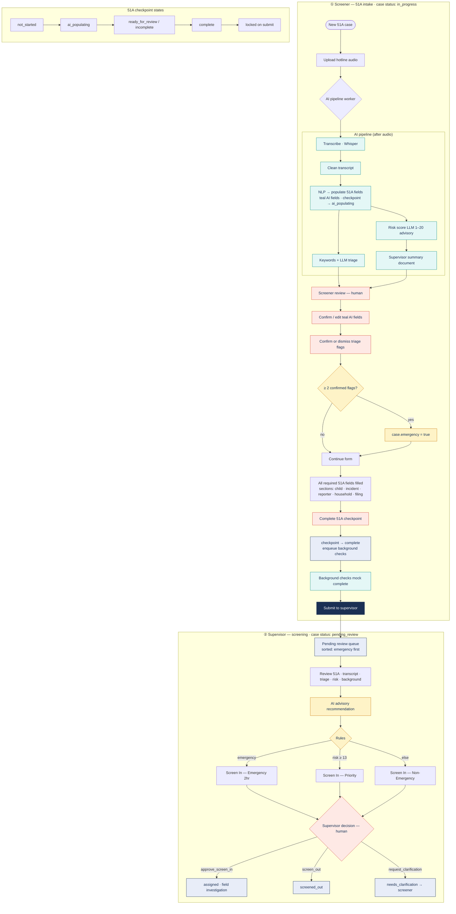
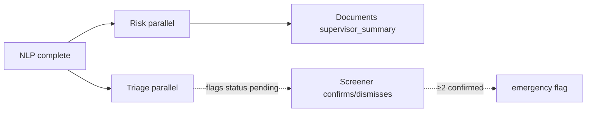

# Screening & 51A Process (DCF AIT Demo)

Mermaid diagram for **screener 51A intake** through **supervisor screening**. Field-worker investigation and 51B are out of scope here.

## Parallel paths (reference)

## Screening decision outcomes

| Decision | Case status | Next step (demo) |
|----------|-------------|------------------|
| `approve_screen_in` | `assigned` | Field worker queue (out of diagram) |
| `screen_out` | `screened_out` | Case closed from screening |
| `request_clarification` | `needs_clarification` | Returns to screener for more 51A work |

## 51A completion gates (before submit)

| Gate | Requirement |
|------|-------------|
| Mandatory fields | All required fields in all sections have values |
| AI fields | Every `source: ai` field has `confirmedByHuman` |
| Checkpoint | `form51a_checkpoint_status === complete` |
| Submit | Sets checkpoint `locked`, case `pending_review` |

## Triage & risk (advisory)

- **Triage:** keyword scan + LLM indicators (DCF Admin config) → `triage_flags` with `pending` → screener `confirm` / `dismiss`
- **Emergency:** API sets `emergency` when **≥ 2** confirmed flags (demo hardcoded; admin `escalationThreshold` in config UI)
- **Risk:** LLM score 1–20 on transcript; default **10** if model fails; not a validated actuarial tool
- **Supervisor AI text:** emergency → Emergency screen-in; else risk **≥ 13** → Priority; else Non-Emergency; triage list appended

## Related files

- SVG (full platform): [screening-process.svg](./screening-process.svg)
- API: `demo/api/src/usecases/form51a/`, `demo/api/src/routes/screening.ts`, `demo/api/src/routes/intake.ts`
- Worker: `demo/worker/worker/pipeline/stages.py`
